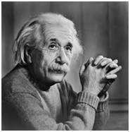
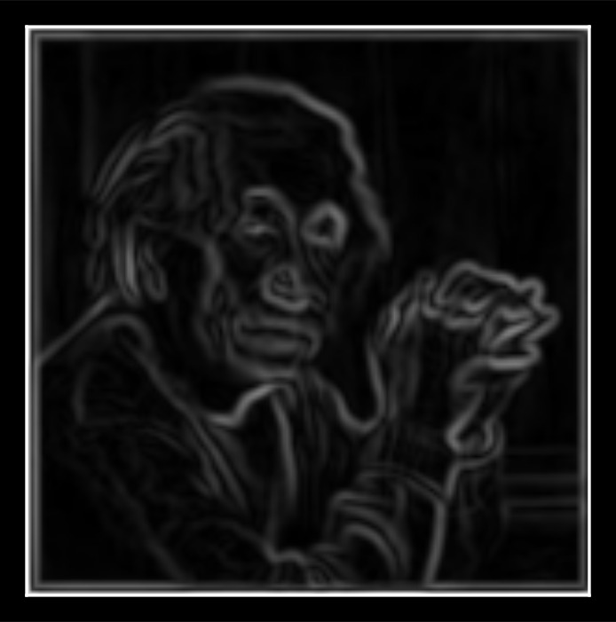

# CV-1 Assignment: CNN Basics

Made by: Pranjal Gulati

### 1. Do you really understand the convolution operation?

Implement the convolution operation and image processing kernels from scratch. The following three kernels need to implemented:

- **Sobel X Kernel**: for gradients in X direction
$$\begin{bmatrix} -1 & 0 & 1 \\ -2 & 0 & 2 \\ -1 & 0 & 1 \\ \end{bmatrix}$$
- **Sobel Y Kernel**: for gradients in Y direction
$$\begin{bmatrix} -1 & -2 & -1 \\ 0 & 0 & 0 \\ 1 & 2 & 1 \\ \end{bmatrix}$$
- **Gaussian Kernel** (with $\sigma = 1.4$): for smoothing

$$\frac{1}{159}
\begin{bmatrix}
2 & 4  & 5  & 4  & 2 \\
4 & 9  & 12 & 9  & 4 \\
5 & 12 & 15 & 12 & 5 \\
4 & 9  & 12 & 9  & 4 \\
2 & 4  & 5  & 4  & 2 \\
\end{bmatrix}$$

The code skeleton is as below:

```python
def conv(image, kernel):
    # implement conv operation here
    raise NotImplementedError
    
def get_kernel(name):
    # return the kernel based on the name
    raise NotImplementedError
```

### 2. Check your implementation

Use [this](assets/lord_einstein.jpg) image for the following steps:
<center>

</center>

- Apply the Gaussian filter on the image. Call the output `smoothened`
- Apply the Sobel X and Sobel Y filters on `smoothened`. Call them `sobel_x` and `sobel_y` respectively.
- Calculate the gradient magnitude: $I_{xy} = \sqrt{I_x(x,y)^2 + I_y(x,y)^2}$ where $I_x$ is `sobel_x`, $I_y$ is `sobel_y` and $(x, y)$ represents a particular pixel.
- Display this gradient magnitude

The output must be as follows:
<center>

</center>

### 3. Do you really understand conv backprop?

Read this [article](https://johnwlambert.github.io/conv-backprop/) to understand how we backprop through conv layers efficiently.